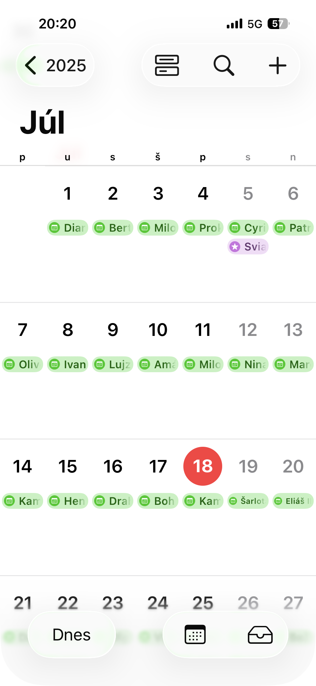
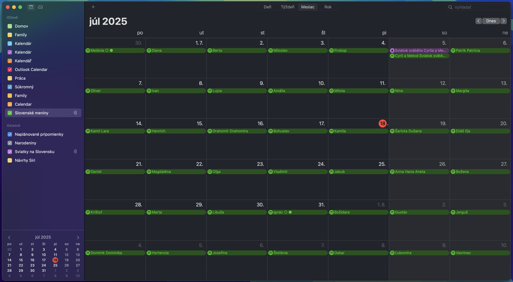

# 📅 Slovenský meninový kalendár

Tento repozitár obsahuje `.ics` súbor s meninami na Slovensku pre celý rok **2025**. Môžete si ho jednoducho pridať do:

- 📱 iPhone / iPad (cez iOS Kalendár)
- 💻 macOS Kalendár
- 📆 Google Kalendár
- 🧠 alebo si nastaviť pripomienky manuálne priamo zo stránky

---

## 🔗 Odkazy

- 🌐 Web verzia: [https://peterfromslovakia.github.io/meniny-kalendar/](https://peterfromslovakia.github.io/meniny-kalendar/)
- 🗂 Prehliadač mien + exportovanie konkrétneho mena: [prehliadac.html](https://peterfromslovakia.github.io/meniny-kalendar/prehliadac.html)
- 📥 ICS súbor: [meniny.ics](https://peterfromslovakia.github.io/meniny-kalendar/meniny.ics)

---

## 📸 Ukážky kalendára

### iPhone (iOS Kalendár)
Zobrazenie menín v aplikácii Kalendár na iPhone:

---

### macOS Kalendár
Zobrazenie slovenských mien v macOS Kalendári:

---

## ℹ️ Ako pridať kalendár do iPhone alebo Macu

1. Otvorte `.ics` súbor v Safari
2. Vyberte „Otvoriť v Kalendári“
3. Pridajte do existujúceho alebo nového kalendára (napr. **Slovenské meniny**)
4. Hotovo – meniny sa zobrazia vo vašom kalendári

---

Vytvoril s ❤️ [Peter Obala](https://github.com/peterfromslovakia)
